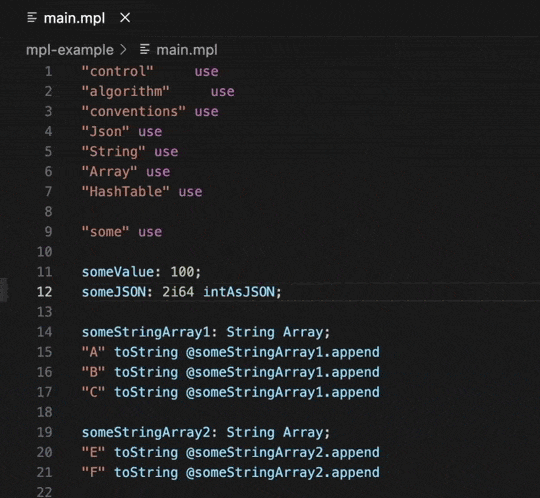
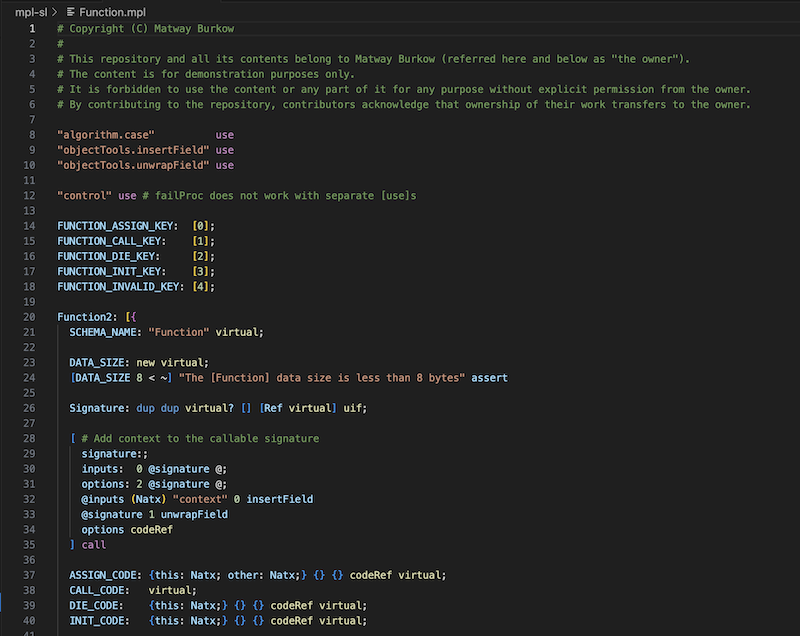
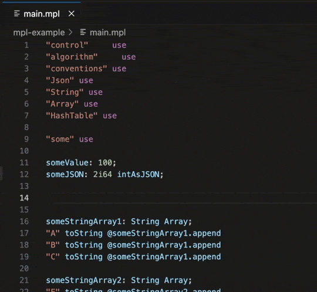

# MPL VS Code

This extension provides support for the [MPL programming language](https://github.com/Matway/mpl-c).
It was put together quickly, contains bugs and inaccuracies, and has not been tested.








It offers the following features:
- Syntax highlighting
- Snippets
- A task to compile the current project
- Navigation to global definitions within the project

## Navigation
Requires [MPL MetaInfo fork](https://github.com/jefremof/mpl-c/tree/meta-info-patch).\
Also requires `mpl.json` config file to be located higher up the directory tree relative to the active file.

## Compilation task
`MPL: Build Active Project`\
Also requires `mpl.json` config file to be located higher up the directory tree relative to the active file.

Extension configurations:
```json
"configuration": {
    "title": "MPL",
    "properties": {
        "compiler.compilerPath": {
            "type": "string",
            "default": "mplc",
            "description": "Path to the MPL compiler executable",
            "scope": "machineOverridable"
        },
        "compiler.includePath": {
            "type": "array",
            "items": {
                "type": "string"
            },
            "default": [
                "./sl"
            ],
            "description": "Default include paths",
            "scope": "machineOverridable"
        },
        "compiler.triple": {
            "type": "string",
            "default": "",
            "description": "Target triple. If empty, uses the compiler default.",
            "scope": "machineOverridable"
        }
    }
},
```

Local project configuration file:
`mpl.json`
```json
{
    "compilerPath": "somePath/compiler/mplc",
    "includePaths": ["somePath/mpl-sl"],
    "triple": "arm64-apple-darwin",
    "entryPoint": "somePath/main.mpl",
    "output": "somePath/output/main.ll",
    "metaInfo": true
}
```

## Snippets
Prefixes:
- "Label","Declare"
- "Object", "Structure"
- "Callable"
- "Function"
- "If"
- "pfunc", "pre"
